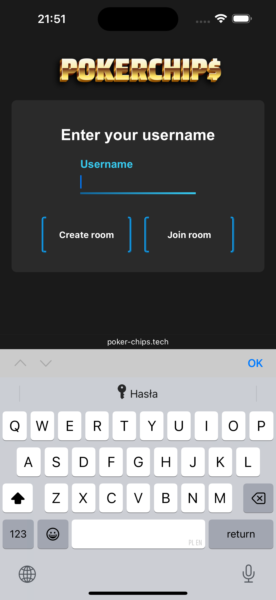
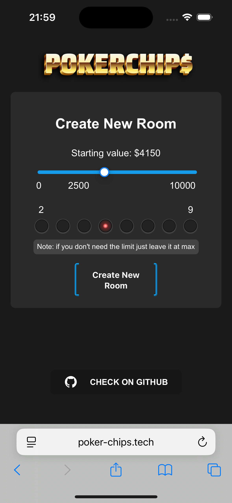
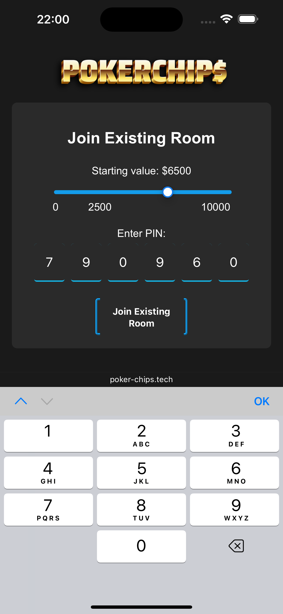
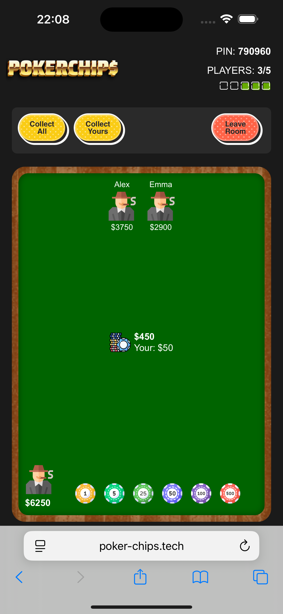
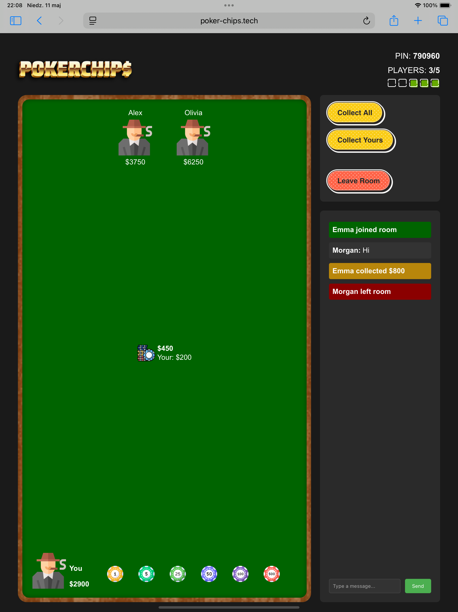

[![Stargazers][stars-shield]][stars-url]
[![Issues][issues-shield]][issues-url]
[![project_license][license-shield]][license-url]
[![LinkedIn][linkedin-shield]][linkedin-url]


<!-- PROJECT LOGO -->
<br />
<div align="center">
  <a href="https://github.com/w3rr0/pokerchips">
    
  </a>

  <p align="center">
    Pokerchip$ is an application that allows you to play poker without physical chips.
    Thanks to it, players can simulate their chips in real time,
    which allows for comfortable gameplay even when they do not have traditional poker accessories with them.
    The perfect solution for playing on the go when taking a poker set would be a big problem.
    <br />
    <a href="https://www.poker-chips.tech"><strong>Try Yourself »</strong></a>
    <br />
    <br />
    <!-- <a href="https://github.com/w3rr0/pokerchips">View Demo</a>
    &middot; -->
    <a href="https://github.com/w3rr0/pokerchips/issues/new?labels=bug&template=bug-report---.md">Report Bug</a>
    &middot;
    <a href="https://github.com/w3rr0/pokerchips/issues/new?labels=enhancement&template=feature-request---.md">Request Feature</a>
  </p>
</div>


<!-- TABLE OF CONTENTS -->
<details>
  <summary>Table of Contents</summary>
  <ol>
    <li>
      <a href="#about-the-project">About The Project</a>
      <ul>
        <li><a href="#for-who">For Who</a></li>
        <li><a href="#why-pokerchip">Why Pokerchip$</a></li>
        <li><a href="#background">Background</a></li>
        <li><a href="#whats-next">What's Next</a></li>
        <li><a href="#built-with">Built With</a></li>
        <li><a href="#design">Design</a></li>
      </ul>
    </li>
    <li>
      <a href="#getting-started">Getting Started</a>
      <ul>
        <li><a href="#prerequisites">Prerequisites</a></li>
        <li><a href="#installation">Installation</a></li>
      </ul>
    </li>
    <li>
      <a href="#usage">Usage</a>
      <ul>
        <li><a href="#home">Home</a></li>
        <li><a href="#join">Join</a></li>
        <li><a href="#create">Create</a></li>
        <li><a href="#gameplay">Gameplay</a></li>
      </ul>
    </li>
    <li><a href="#roadmap">Roadmap</a></li>
    <li><a href="#contributing">Contributing</a></li>
    <li><a href="#license">License</a></li>
    <li><a href="#contact">Contact</a></li>
    <li><a href="#acknowledgments">Acknowledgments</a></li>
  </ol>
</details>


<!-- ABOUT THE PROJECT -->
# About The Project

### For who

For all those who, whether away or at home,
want to play poker with friends but do not have a poker set with them.
Now all you need to play is cards.

### Why pokerchip$

It's simple! Pokerchip$ is simple, free, and gives you full control over your chips.
It doesn't restrict your style of play in any way.
You can play by your own rules and the chip system won't limit you.

### Background

The idea was born when I noticed that on many trips with friends we wanted to play poker,
but we almost never took poker accessories.
Someone always had cards, and they were not a problem,
and playing online is not the same as playing live, so pokerchip$ was perfect for such situations.

### What's next

I've already added all the key things that I thought were necessary for the app to work well. However, if new plans appear, I'll be introducing them on an ongoing basis.


<p align="right">(<a href="#readme-top">back to top</a>)</p>


## Built With

<div style="display: flex; align-items: center; font-size: 32px; gap: 10px; justify-content: center;">
    
    +
    
    +
    
</div>

- Backend
  - FastAPI 0.115
  - Python 3.12
- Frontend
  - React 19
- Server
  - Azure App Service
  - Azure Static Web App


<p align="right">(<a href="#readme-top">back to top</a>)</p>


### Design

Here's a design sample from the current version of the app:

<div style="display: flex; gap: 15px" align="center">
    
    
    
</div>

<div style="display: flex; gap: 15px; margin-top: 25px;" align="center">
    
    
</div>


<p align="right">(<a href="#readme-top">back to top</a>)</p>


<!-- GETTING STARTED -->
## Getting Started

This is an example of how you may give instructions on setting up your project locally.
To get a local copy up and running follow these simple example steps.

### Prerequisites

This is an example of how to list things you need to use the software and how to install them.
* npm
  ```sh
  npm install npm@latest -g
  ```

## Installation

1. Get a free API Key at [https://example.com](https://example.com)
2. Clone the repo
   ```sh
   git clone https://github.com/w3rr0/pokerchips.git
   ```
3. Install NPM packages
   ```sh
   npm install
   ```
4. Enter your API in `config.js`
   ```js
   const API_KEY = 'ENTER YOUR API';
   ```
5. Change git remote url to avoid accidental pushes to base project
   ```sh
   git remote set-url origin w3rr0/pokerchips
   git remote -v # confirm the changes
   ```

<p align="right">(<a href="#readme-top">back to top</a>)</p>


<!-- USAGE EXAMPLES -->
# Usage

### Home

To start the game, you have 2 options either join a friend's room or create your own.
Enter your nickname (between 1 and 15 characters) and select one of these options by clicking the appropriate button.

### Join

When joining, you must enter the PIN of the room you want to join and choose your starting token value (from 0 to 10,000,
the default is 2,500). Once you do this, confirm with the button, and you will be transferred to the game

### Create

If you are the one creating the room, you also have to choose your starting value of your tokens and the maximum number of players that can play at the same time
(from 2 to 9, but if you don't care about the limit, I recommend leaving it at 9, you never know if someone will want to join you 😉)

### Gameplay

Once you join a room, you will see all the information about the room such as:

- PIN
- Current number of players
- Player limit in room

A table that simulates the one during live play, containing:

- At the bottom
  - your avatar with information about the current value of all tokens
  - tokens corresponding to the amount you selected
- In the middle
  - the amount currently placed on the table by all players
  - the value of the bet you are currently placing
- At the top
  - avatars of the rest of the players along with the amount they have (If you are alone in the room, a message will be displayed that there are no other players)

An additional section for controlling the game where you will find:

- control buttons
  - collecting your chips from the table
  - collecting the winnings, i.e., all the chips on the table
  - leaving the room
- an additional chat section (if you are using a device with a large enough screen, such as a PC, laptop, or some tablets), where you will find:
  - messages sent by other users since you joined the room
  - gameplay history, from which you can learn about who:
    - join
    - left
    - win (and how much)

To place a bet, simply click on a chip with the appropriate value.

All events are updated continuously for each player without the need to refresh the page.

For a more detailed explanation of how everything works under the hood,
please visit the documentation for the individual functions found in the project source files.

<p align="right">(<a href="#readme-top">back to top</a>)</p>


<!-- ROADMAP -->
# Roadmap

- [ ] Feature 1
- [ ] Feature 2
- [ ] Feature 3
    - [ ] Nested Feature

See the [open issues](https://github.com/w3rr0/pokerchips/issues) for a full list of proposed features (and known issues).

<p align="right">(<a href="#readme-top">back to top</a>)</p>


<!-- CONTRIBUTING -->
# Contributing

Any contributions you make are **greatly appreciated**!

If you have a suggestion that would make this better, please fork the repo and create a pull request. You can also simply open an issue with the tag "enhancement".
Don't forget to give the project a star! Thanks again!

1. Fork the Project
2. Create your Feature Branch (`git checkout -b feature/AmazingFeature`)
3. Commit your Changes (`git commit -m 'Add some AmazingFeature'`)
4. Push to the Branch (`git push origin feature/AmazingFeature`)
5. Open a Pull Request

<p align="right">(<a href="#readme-top">back to top</a>)</p>

<!--
## Top contributors:

<a href="https://github.com/w3rr0/pokerchips/graphs/contributors">
  
</a>

-->


<!-- LICENSE -->
# License

Distributed under the MIT License. See `LICENSE.txt` for more information.

<p align="right">(<a href="#readme-top">back to top</a>)</p>


<!-- CONTACT -->
# Contact

Linkedin: [Konrad Mateja][linkedin-url]

Project Link: [https://github.com/w3rr0/pokerchips](https://github.com/w3rr0/pokerchips)

<p align="right">(<a href="#readme-top">back to top</a>)</p>


<!-- ACKNOWLEDGMENTS -->
# Acknowledgments

* []()
* []()
* []()

<p align="right">(<a href="#readme-top">back to top</a>)</p>


<!-- MARKDOWN LINKS & IMAGES -->
<!-- https://www.markdownguide.org/basic-syntax/#reference-style-links -->
[stars-shield]: https://img.shields.io/github/stars/w3rr0/pokerchips.svg?style=for-the-badge
[stars-url]: https://github.com/w3rr0/pokerchips/stargazers
[issues-shield]: https://img.shields.io/github/issues/w3rr0/pokerchips.svg?style=for-the-badge
[issues-url]: https://github.com/w3rr0/pokerchips/issues
[license-shield]: https://img.shields.io/github/license/w3rr0/pokerchips.svg?style=for-the-badge
[license-url]: https://github.com/w3rr0/pokerchips/blob/master/LICENSE.txt
[linkedin-shield]: https://img.shields.io/badge/-LinkedIn-black.svg?style=for-the-badge&logo=linkedin&colorB=555
[linkedin-url]: https://linkedin.com/in/konrad-mateja-00bbbb335